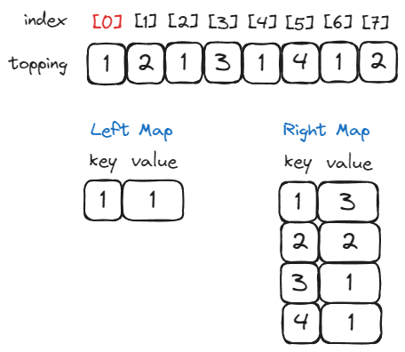
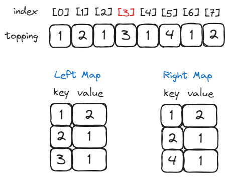
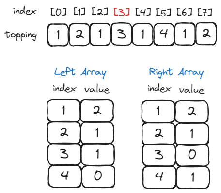

## 문제

### 링크

[프로그래머스/롤케이크 자르기](https://school.programmers.co.kr/learn/courses/30/lessons/132265)

<br>

### 문제 설명

철수는 롤케이크를 두 조각으로 잘라서 동생과 한 조각씩 나눠 먹으려고 합니다. 이 롤케이크에는 여러가지 토핑들이 일렬로 올려져 있습니다. 철수와 동생은 롤케이크를 공평하게 나눠먹으려 하는데, 그들은 롤케이크의 크기보다 롤케이크 위에 올려진 토핑들의 종류에 더 관심이 많습니다. 그래서 잘린 조각들의 크기와 올려진 토핑의 개수에 상관없이 각 조각에 동일한 가짓수의 토핑이 올라가면 공평하게 롤케이크가 나누어진 것으로 생각합니다.

예를 들어, 롤케이크에 4가지 종류의 토핑이 올려져 있다고 합시다. 토핑들을 1, 2, 3, 4와 같이 번호로 표시했을 때, 케이크 위에 토핑들이 [1, 2, 1, 3, 1, 4, 1, 2] 순서로 올려져 있습니다. 만약 세 번째 토핑(1)과 네 번째 토핑(3) 사이를 자르면 롤케이크의 토핑은 [1, 2, 1], [3, 1, 4, 1, 2]로 나뉘게 됩니다. 철수가 [1, 2, 1]이 놓인 조각을, 동생이 [3, 1, 4, 1, 2]가 놓인 조각을 먹게 되면 철수는 두 가지 토핑(1, 2)을 맛볼 수 있지만, 동생은 네 가지 토핑(1, 2, 3, 4)을 맛볼 수 있으므로, 이는 공평하게 나누어진 것이 아닙니다. 만약 롤케이크의 네 번째 토핑(3)과 다섯 번째 토핑(1) 사이를 자르면 [1, 2, 1, 3], [1, 4, 1, 2]로 나뉘게 됩니다. 이 경우 철수는 세 가지 토핑(1, 2, 3)을, 동생도 세 가지 토핑(1, 2, 4)을 맛볼 수 있으므로, 이는 공평하게 나누어진 것입니다. 공평하게 롤케이크를 자르는 방법은 여러가지 일 수 있습니다. 위의 롤케이크를 [1, 2, 1, 3, 1], [4, 1, 2]으로 잘라도 공평하게 나뉩니다. 어떤 경우에는 롤케이크를 공평하게 나누지 못할 수도 있습니다.

롤케이크에 올려진 토핑들의 번호를 저장한 정수 배열 `topping`이 매개변수로 주어질 때, 롤케이크를 공평하게 자르는 방법의 수를 return 하도록 solution 함수를 완성해주세요.

<br>

### 입력 & 출력

#### 제한사항

- 1 ≤ `topping`의 길이 ≤ 1,000,000
    - 1 ≤ `topping`의 원소 ≤ 10,000

#### 입출력 예

|topping|result|
|---|---|
|[1, 2, 1, 3, 1, 4, 1, 2]|2|
|[1, 2, 3, 1, 4]|0|

<br>

## 풀이

문제의 핵심은 <b>토핑 종류의 개수가 같을 것</b>과 <b>모든 방법의 수</b>를 구하는 것이다.  

먼저 두 조각을 나누기 위한 기준점이 필요하기 때문에 입력(`topping`)의 원소를 모두 반복하면서 기준점을 옮긴다.  

예를 들어서 기준점이 index = 0이라면 조각은 [1], [2, 1, 3, 1, 4, 1, 2]로 나눌 수 있다.  


또, index = 3이라면 조각은 [1, 2, 1, 3], [1, 4, 1, 2]로 나눌 수 있다.  


이제 중요한 부분은 조각을 나누었을 때 <b>각 조각에 있는 토핑 종류의 개수를 알아내고, 비교하는 것</b>이다.   

<br>

조각을 나눌 때마다 단순하게 두 조각의 토핑의 종류를 구하게 되면 <n>O(n ^ 2)</n>의 시간 복잡도를 갖는다.
이는 입력의 개수 `1,000,000`일 경우 적절하지 않는 방법이 된다.  

<br>

### 풀이 1

조각을 나눌 때마다 매 번 토핑의 종류를 구하는 방법 대신에, <b>기존에 구해 놓은 종류에서 업데이트 하는 방법</b>을 생각해보았다.  

2개의 `HashMap` 자료 구조를 이용해서 index = 0부터 두 조각으로 나눠 각 토핑의 종류와 개수를 저장한다.    

이후 입력(`topping`)을 반복하면서 2개의 `HashMap`에 토핑 종류와 개수를 업데이트 함으로써 문제를 해결하였다.  

예를 들어서 index = 0일 때, 나눈 각 조각의 토핑 종류와 개수는 {1:1}, {1:3, 2:2, 3:1, 4:1}이다.  



또한 index = 3일 때, 나눈 각 조강의 토핑 종류와 개수는 {1:2, 2:1, 3:1}, {1:2, 2:1, 4:1}이다.  



그리고 매 번 두 `HashMap`의 size를 비교하면 된다.  

<br>

#### 시간 복잡도

먼저 모든 입력(`topping`)의 개수가 n일 때, 모두 반복해야 한다. &rarr; O(n)  

`HashMap`의 `put()`, `getOrDefault()`, `remove()`, `size()` 메서드는 모두 O(1)이다.  

결과적으로 <b>O(n)</b>이다.  

<br>

#### 구현 코드

```java
package level2.롤케이크자르기;

import java.util.HashMap;
import java.util.Map;

public class solve_1st_01 {
    class Solution {
        public int solution(int[] topping) {
            int answer = 0;

            Map<Integer, Integer> leftMap = new HashMap<>();
            Map<Integer, Integer> rightMap = new HashMap<>();

            //init
            leftMap.put(topping[0], 1);
            for (int i = 1; i < topping.length; i++)
                rightMap.put(topping[i], rightMap.getOrDefault(topping[i], 0) + 1);

            if (leftMap.size() == rightMap.size())
                answer++;

            for (int i = 1; i < topping.length - 1; i++) {
                int t = topping[i];
                leftMap.put(t, leftMap.getOrDefault(t, 0) + 1);
                rightMap.put(t, rightMap.get(t) - 1);
                if (rightMap.get(t) == 0)
                    rightMap.remove(t);

                if (leftMap.size() == rightMap.size())
                    answer++;
            }

            return answer;
        }
    }
}
```

<br>

### 풀이 2

위의 풀이 방법에서 `HashMap`을 `Array`로 관리하는 방법이다.  

먼저 롤케이크의 모든 토핑 종류와 개수를 배열에 초기화한다.  


그리고 초기화한 배열(`Right Array`)을 반복하면서 value가 1이상인 인덱스에 한해, 종류의 개수를 증가시킨다.  

이후 입력(`topping`)을 반복하면서 `Array`의 값을 조절하고, 0을 기준으로 종류의 개수를 수정하면 된다.  


<br>



<br>

#### 시간 복잡도

입력(`topping`)의 길이가 n일 때 모두 반복해야 하므로 &rarr; <b>O(n)</b>으로 끝낼 수 있다.   

<br>

#### 구현 코드

```java
package level2.롤케이크자르기;

public class solve_1st_02 {
    class Solution {
        public int solution(int[] topping) {
            int answer = 0;
            int[] left = new int[10001], right = new int[10001];
            int ls = 0, rs = 0;
            for(var i : topping) right[i]++;
            for(var i : right) rs += i > 0 ? 1 : 0;
            for(var i : topping) {
                right[i]--;
                if (right[i] == 0) rs--;
                if (left[i] == 0) ls++;
                left[i]++;
                if (rs == ls) answer++;
            }
            return answer;
        }
    }
}
```

<br>

### 정합성 비교 : 풀이 1 vs 풀이 2

|          | 풀이 1                 | 풀이 2                |
| -------- | -------------------- | ------------------- |
| 테스트 1 〉  | 통과 (16.19ms, 81.2MB) | 통과 (1.38ms, 79.6MB) |
| 테스트 2 〉  | 통과 (51.00ms, 94.6MB) | 통과 (5.15ms, 90.2MB) |
| 테스트 3 〉  | 통과 (28.45ms, 90.8MB) | 통과 (5.15ms, 96.9MB) |
| 테스트 4 〉  | 통과 (28.35ms, 97.8MB) | 통과 (3.48ms, 87.2MB) |
| 테스트 5 〉  | 통과 (110.80ms, 158MB) | 통과 (20.84ms, 138MB) |
| 테스트 6 〉  | 통과 (203.64ms, 195MB) | 통과 (18.84ms, 125MB) |
| 테스트 7 〉  | 통과 (201.58ms, 180MB) | 통과 (17.55ms, 124MB) |
| 테스트 8 〉  | 통과 (234.23ms, 192MB) | 통과 (22.66ms, 127MB) |
| 테스트 9 〉  | 통과 (210.34ms, 171MB) | 통과 (17.34ms, 134MB) |
| 테스트 10 〉 | 통과 (254.61ms, 165MB) | 통과 (15.00ms, 122MB) |
| 테스트 11 〉 | 통과 (31.15ms, 78.4MB) | 통과 (3.05ms, 79.8MB) |
| 테스트 12 〉 | 통과 (18.94ms, 78.6MB) | 통과 (0.86ms, 79.2MB) |
| 테스트 13 〉 | 통과 (213.35ms, 174MB) | 통과 (24.55ms, 135MB) |
| 테스트 14 〉 | 통과 (186.29ms, 184MB) | 통과 (23.25ms, 123MB) |
| 테스트 15 〉 | 통과 (217.95ms, 187MB) | 통과 (28.31ms, 137MB) |
| 테스트 16 〉 | 통과 (197.47ms, 181MB) | 통과 (24.23ms, 135MB) |
| 테스트 17 〉 | 통과 (214.04ms, 182MB) | 통과 (18.95ms, 135MB) |
| 테스트 18 〉 | 통과 (228.43ms, 187MB) | 통과 (19.61ms, 130MB) |
| 테스트 19 〉 | 통과 (281.63ms, 174MB) | 통과 (13.75ms, 123MB) |
| 테스트 20 〉 | 통과 (248.53ms, 173MB) | 통과 (15.90ms, 134MB) |