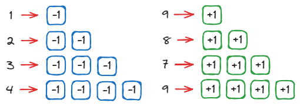
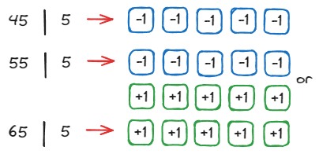

## 문제

### 링크

[프로그래머스/마법의 엘리베이터](https://school.programmers.co.kr/learn/courses/30/lessons/148653)

<br>

### 문제 설명

마법의 세계에 사는 민수는 아주 높은 탑에 살고 있습니다. 탑이 너무 높아서 걸어 다니기 힘든 민수는 마법의 엘리베이터를 만들었습니다. 마법의 엘리베이터의 버튼은 특별합니다. 마법의 엘리베이터에는 -1, +1, -10, +10, -100, +100 등과 같이 절댓값이 10c (c ≥ 0 인 정수) 형태인 정수들이 적힌 버튼이 있습니다. 마법의 엘리베이터의 버튼을 누르면 현재 층 수에 버튼에 적혀 있는 값을 더한 층으로 이동하게 됩니다. 단, 엘리베이터가 위치해 있는 층과 버튼의 값을 더한 결과가 0보다 작으면 엘리베이터는 움직이지 않습니다. 민수의 세계에서는 0층이 가장 아래층이며 엘리베이터는 현재 민수가 있는 층에 있습니다.

마법의 엘리베이터를 움직이기 위해서 버튼 한 번당 마법의 돌 한 개를 사용하게 됩니다.예를 들어, 16층에 있는 민수가 0층으로 가려면 -1이 적힌 버튼을 6번, -10이 적힌 버튼을 1번 눌러 마법의 돌 7개를 소모하여 0층으로 갈 수 있습니다. 하지만, +1이 적힌 버튼을 4번, -10이 적힌 버튼 2번을 누르면 마법의 돌 6개를 소모하여 0층으로 갈 수 있습니다.

마법의 돌을 아끼기 위해 민수는 항상 최소한의 버튼을 눌러서 이동하려고 합니다. 민수가 어떤 층에서 엘리베이터를 타고 0층으로 내려가는데 필요한 마법의 돌의 최소 개수를 알고 싶습니다. 민수와 마법의 엘리베이터가 있는 층을 나타내는 정수 `storey` 가 주어졌을 때, 0층으로 가기 위해 필요한 마법의 돌의 최소값을 return 하도록 solution 함수를 완성하세요.

<br>

### 입력 & 출력

#### 제한사항

- 1 ≤ `storey` ≤ 100,000,000

#### 입출력 예

|storey|result|
|---|---|
|16|6|
|2554|16|

<br>

---

## 풀이

입력(`storey`)과 조건(-1, 1, -10, 10, ...)을 가지고 <b>10의 제곱</b>을 만드는 것이 중요하다.  

예를 들어 1000과 10000 사이의 어떤 수(`storey`)에 대해서, 1000 혹은 10000을 만들어 마법의 돌의 최소값을 구할 수 있다.  

그를 위해서는 각 자리의 숫자들을 10단위로 만들어야 한다.  



자릿수가 1, 2, 3, 4일 때는 - 버튼을 누르는 게 빠르고, 6, 7, 8, 9일 때는 + 버튼을 누르는 게 빠르다.  

5일 때는 바로 앞자리의 숫자를 비교해서 -/+ 버튼을 구분한다.  

앞자리가 1, 2, 3, 4일 때는 - 버튼, 5, 6, 7, 8, 9일 때는 + 버튼을 누른다.  



<br>

### 시간 복잡도

입력(`storey`)의 길이가 n이라면 <b>O(n)</b>이다.  

<br>

### 구현 코드

```java
package level2.마법의엘리베이터;

public class solve_1st {
    class Solution {
        public int solution(int storey) {
            int answer = 0;

            while (storey > 0) {
                int n = storey % 10;
                storey /= 10;

                if (n == 5) {
                    if (storey % 10 >= 5) {
                        answer += 10 - n;
                        storey++;
                    } else {
                        answer += n;
                    }
                } else if (n < 5) {
                    answer += n;
                } else {
                    answer += 10 - n;
                    storey++;
                }
            }

            return answer;
        }
    }
}
```