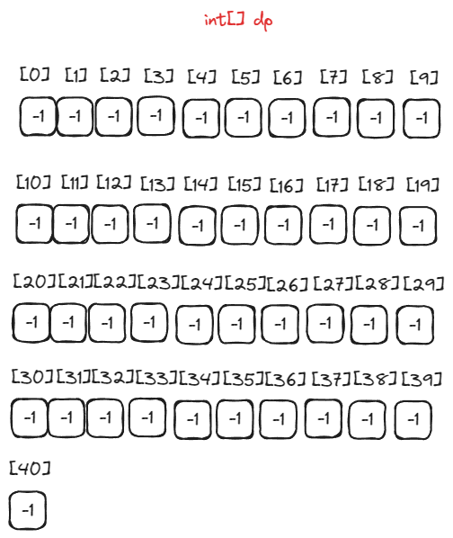
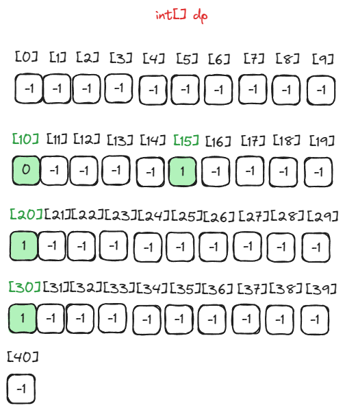
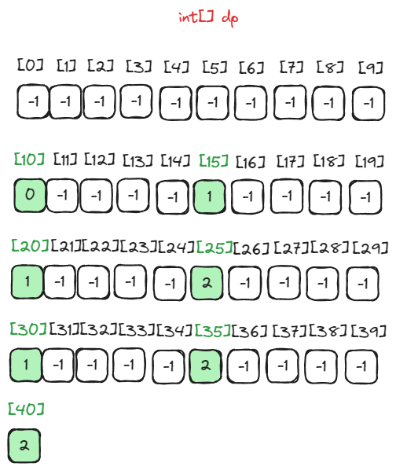

## 문제

### 링크

[프로그래머스/숫자 변환하기](https://school.programmers.co.kr/learn/courses/30/lessons/154538)

<br>

### 문제 설명

자연수 `x`를 `y`로 변환하려고 합니다. 사용할 수 있는 연산은 다음과 같습니다.

- `x`에 `n`을 더합니다
- `x`에 2를 곱합니다.
- `x`에 3을 곱합니다.

자연수 `x`, `y`, `n`이 매개변수로 주어질 때, `x`를 `y`로 변환하기 위해 필요한 최소 연산 횟수를 return하도록 solution 함수를 완성해주세요. 이때 `x`를 `y`로 만들 수 없다면 -1을 return 해주세요.

<br>

### 입력 & 출력

#### 제한사항

- 1 ≤ `x` ≤ `y` ≤ 1,000,000
- 1 ≤ `n` < `y`

#### 입출력 예

|x|y|n|result|
|---|---|---|---|
|10|40|5|2|
|10|40|30|1|
|2|5|4|-1|

<br>

## 풀이

일반적으로 문제에서 주어진 세 가지 연산의 모든 경우의 수는 아래와 같이 O(3^n)으로 진행된다.  


이때 연산의 결과가 반복되는 것을 확인할 수 있다.  


예를 들어서 위의 그림과 같이 연산의 결과 `3`이 첫 번째 연산과 두 번째 연산에서 반복된다. 
이때 `3`에 대한 최소 연산 횟수는 1이다.  

반복되는 결과에 대한 연산 횟수를 제거하여 시간 복잡도를 줄일 수 있는데, 다이나믹 프로그래밍을 활용한다.    

<br>

<b>다이나믹 프로그래밍 활용</b>

먼저 입력 `y`크기의 배열(`dp`)을 준비한다.  



그리고 인덱스 `x`부터 반복하면서 해당 인덱스를 결과로 가지는 연산 중 최솟값에 +1을 업데이트한다.  

예를 들어서 `x=10`, `y=40`, `n=5`를 가정해본다.  

처음에 `x=10`과 세 연산의 결과값을 초기화 한다.  



이후부터는 인덱스를 반복하면서 `-1`을 제외한 값을 이용하여 업데이트한다. 
인덱스 `21`에 대해서 세 연산으로 만족하는 이전 값이 없기 때문에 `-1`을 그대로 둔다.  

인덱스 `25`에 대해서 `25 - n` 값이 `1`이기 때문에 `1+1`로 업데이트한다.  

이를 반복하다 보면 인덱스 `40`에 대해서 인덱스 `20`과 인덱스 `35`가 서로 만족되는데, 
최솟값으로 인덱스 `20`을 반영하여 `1+1`을 업데이트한다.  



<br>

### 시간 복잡도

새로 만드는 배열(`dp`)의 크기만큼 반복하면 되기 때문에 <b>O(y)</b>이다.  

<br>

### 구현 코드

```java
package level2.숫자변환하기;

import java.util.Arrays;

public class solve_1st {
    class Solution {
        public int solution(int x, int y, int n) {
            int answer = 0;

            int[] dp = new int[y + 1];
            Arrays.fill(dp, -1);
            dp[x] = 0;
            if (2*x <= y)
                dp[2 * x] = 1;
            if (3*x <= y)
                dp[3 * x] = 1;
            if (x + n <= y)
                dp[x + n] = 1;

            for (int i = x + 1; i <= y; i++) {
                if (i - n > 0 && dp[i - n] >= 0) {
                    dp[i] = dp[i - n] + 1;
                }
                if (i%2 == 0 && dp[i/2] >= 0) {
                    dp[i] = dp[i/2] + 1;
                    if (i - n >= x && dp[i - n] >= 0)
                        dp[i] = Math.min(dp[i/2], dp[i - n]) + 1;
                }
                if (i%3 == 0 && dp[i/3] >= 0) {
                    dp[i] = dp[i/3] + 1;
                    if (i - n >= x && dp[i - n] >= 0)
                        dp[i] = Math.min(dp[i/3], dp[i - n]) + 1;
                }
                if (i%6 == 0 && dp[i/2] >= 0 && dp[i/3] >= 0) {
                    dp[i] = Math.min(dp[i/2], dp[i/3]) + 1;
                    if (i - n >= x && dp[i - n] >= 0) {
                        dp[i] = Math.min(dp[i/2], Math.min(dp[i/3], dp[i - n])) + 1;
                    }
                }
            }
            //System.out.println(Arrays.toString(dp));
            answer = dp[y];

            return answer;
        }
    }
}
```