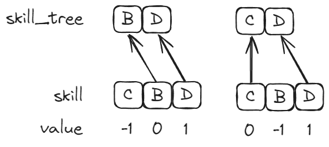

## 문제

### 링크

[프로그래머스/스킬트리](https://school.programmers.co.kr/learn/courses/30/lessons/49993)

<br>

### 문제 설명

선행 스킬이란 어떤 스킬을 배우기 전에 먼저 배워야 하는 스킬을 뜻합니다.

예를 들어 선행 스킬 순서가 `스파크 → 라이트닝 볼트 → 썬더`일때, 썬더를 배우려면 먼저 라이트닝 볼트를 배워야 하고, 라이트닝 볼트를 배우려면 먼저 스파크를 배워야 합니다.

위 순서에 없는 다른 스킬(힐링 등)은 순서에 상관없이 배울 수 있습니다. 따라서 `스파크 → 힐링 → 라이트닝 볼트 → 썬더`와 같은 스킬트리는 가능하지만, `썬더 → 스파크`나 `라이트닝 볼트 → 스파크 → 힐링 → 썬더`와 같은 스킬트리는 불가능합니다.

선행 스킬 순서 skill과 유저들이 만든 스킬트리[1](https://school.programmers.co.kr/learn/courses/30/lessons/49993#fn1)를 담은 배열 skill_trees가 매개변수로 주어질 때, 가능한 스킬트리 개수를 return 하는 solution 함수를 작성해주세요.

<br>

### 입력 & 출력

#### 제한 조건

- 스킬은 알파벳 대문자로 표기하며, 모든 문자열은 알파벳 대문자로만 이루어져 있습니다.
- 스킬 순서와 스킬트리는 문자열로 표기합니다.
    - 예를 들어, `C → B → D` 라면 "CBD"로 표기합니다
- 선행 스킬 순서 skill의 길이는 1 이상 26 이하이며, 스킬은 중복해 주어지지 않습니다.
- skill_trees는 길이 1 이상 20 이하인 배열입니다.
- skill_trees의 원소는 스킬을 나타내는 문자열입니다.
    - skill_trees의 원소는 길이가 2 이상 26 이하인 문자열이며, 스킬이 중복해 주어지지 않습니다.

#### 입출력 예

|skill|skill_trees|return|
|---|---|---|
|`"CBD"`|`["BACDE", "CBADF", "AECB", "BDA"]`|2|

<br>

## 풀이

배열 `skill_trees`의 스킬트리들에 대해서 여러 경우의 수를 확인해봐야 한다.    

`skill` = "CBD" 일 때,

1. `skill`에 없는 스킬들로만 이루어진 경우 &rarr; "AETO"
2. `skill`로만 이루어진 경우 &rarr; "CBD", "BCD"
3. `skill`의 일부로만 이루어진 경우 &rarr; "CB", "BD", "CD"
4. `skill` 일부와 다른 스킬들 &rarr; "CBAF", "BACE"
5. `skill` 전부와 다른 스킬들 &rarr; "CBADF", "BACDE"

<br>

위의 모든 경우에서 불가능한 스킬트리는 다음과 같다.  

1. 순서를 만족하지 않음 &rarr; `"BCD", "BACE", "BACDE"`
2. 누락됨 &rarr; `"BD", "CD"`

이 두 가지 경우에 해당하는 스킬트리는 불가능하기 때문에 무시하고, 다른 스키트리에 대해서 스킬트리 개수를 카운트한다.  

가능/불가능을 구분하기 위해서 문자열 `skill_tree` 내에 `skill`의 각 문자가 어느 위치(인덱스)에 존재하는 지 파악할 필요가 있다. 
존재하지 않는다면 `-1`이고, 존재한다면 `0 이상의 정수` 값을 가진다.  

<b>1. 순서를 만족하지 않음</b>  
순서를 만족하지 않는 경우는 다음과 같이 나타낼 수 있다.


`skill_tree`에 존재하는 `skill` 문자에 대해서(`0 이상의 정수값 가짐`) `prev`가 `curr` 의 value보다 더 크면 안된다.  

위의 그림에서 첫 번째 예제는 `C` = `1`인데 `B` = `0`이다. 이는 불가능한 스킬트리이다.  

<br>

<b>2. 누락됨</b>

순서는 맞는 것 같지만 이전 스킬트리가 누락되어 있는 경우이다.  



위의 그림에서 첫 번째 예제는 `B`가 존재하지만 이전 스킬트리인 `C` = `-1`으로 불가능하며, 
두 번째 예제는 `D`가 존재하지만 이전 스킬트리인 `B` = `-1`로 불가능하다.  

두 가지 불가능한 경우를 구현하면 다음과 같다.  

```java
if (prev == -1 && curr >= 0) break; //불가능 &rarr; 누락됨
if (curr != -1 && prev > curr) break; //불가능 &rarr; 순서를 만족하지 않음
```

그 외의 경우에 해당하는 스킬트리에 대해서는 카운트를 진행함으로써 문제를 해결한다.  

<br>

### 시간 복잡도

문자열 배열 `skill_trees`의 길이가 `n`, 원소는 `m`이고, 문자열 `skill`의 길이가 `s`일 때, 
`skill_trees`를 모두 반복한다. &rarr; O(n)  

`skill`의 모든 원소를 반복하며 `value`를 찾는다. &rarr; O(s)  

`skill_trees`의 원소 문자열에서 `skill` 문자 한 개의 인덱스를 찾는 연산 `indexOf()` &rarr; O(m)  

결과적으로 시간 복잡도는 <b>O(n * s * m)</b>이다.  

최악의 경우 20 * 26 * 26 = 13,520번 반복한다.  

<br>

### 구현 코드

```java
package level2.스킬트리;

public class solve_1st {
    class Solution {
        public int solution(String skill, String[] skill_trees) {
            int answer = 0;

            int len = skill.length();
            for (String s : skill_trees) {
                int prev = s.indexOf(skill.charAt(0));
                if (len == 1)
                    answer++;
                for (int i = 1; i < len; i++) {
                    int curr = s.indexOf(skill.charAt(i));
                    if (prev == -1 && curr >= 0) break;
                    if (curr != -1 && prev > curr) break;
                    if (i == len - 1) answer++;
                    prev = curr;
                }
            }

            return answer;
        }
    }
}
```