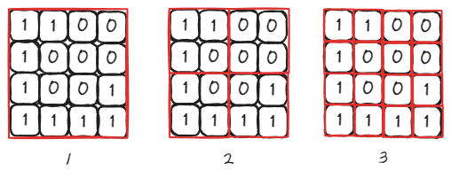
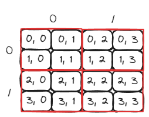

## 문제

### 링크

[프로그래머스/쿼드압축 후 개수 세기](https://school.programmers.co.kr/learn/courses/30/lessons/68936)

<br>

### 문제 설명

0과 1로 이루어진 2n x 2n 크기의 2차원 정수 배열 arr이 있습니다. 당신은 이 arr을 [쿼드 트리](https://en.wikipedia.org/wiki/Quadtree)와 같은 방식으로 압축하고자 합니다. 구체적인 방식은 다음과 같습니다.

1. 당신이 압축하고자 하는 특정 영역을 S라고 정의합니다.
2. 만약 S 내부에 있는 모든 수가 같은 값이라면, S를 해당 수 하나로 압축시킵니다.
3. 그렇지 않다면, S를 정확히 4개의 균일한 정사각형 영역(입출력 예를 참고해주시기 바랍니다.)으로 쪼갠 뒤, 각 정사각형 영역에 대해 같은 방식의 압축을 시도합니다.

arr이 매개변수로 주어집니다. 위와 같은 방식으로 arr을 압축했을 때, 배열에 최종적으로 남는 0의 개수와 1의 개수를 배열에 담아서 return 하도록 solution 함수를 완성해주세요.

<br>

### 입력 & 출력

#### 제한사항

- arr의 행의 개수는 1 이상 1024 이하이며, 2의 거듭 제곱수 형태를 하고 있습니다. 즉, arr의 행의 개수는 1, 2, 4, 8, ..., 1024 중 하나입니다.
    - arr의 각 행의 길이는 arr의 행의 개수와 같습니다. 즉, arr은 정사각형 배열입니다.
    - arr의 각 행에 있는 모든 값은 0 또는 1 입니다.

#### 입출력 예

|arr|result|
|---|---|
|`[[1,1,0,0],[1,0,0,0],[1,0,0,1],[1,1,1,1]]`|`[4,9]`|
|`[[1,1,1,1,1,1,1,1],[0,1,1,1,1,1,1,1],[0,0,0,0,1,1,1,1],[0,1,0,0,1,1,1,1],[0,0,0,0,0,0,1,1],[0,0,0,0,0,0,0,1],[0,0,0,0,1,0,0,1],[0,0,0,0,1,1,1,1]]`|`[10,15]`|

<br>

## 풀이

입력 배열의 크기 `n`에 대해서 특정 영역 S는 `n + 1`번 구해진다.  



이렇게 나눈 S들을 검사하여 압축을 하면 되는데 S별 원소에 접근할 방법이 필요하다.

먼저 S에 번호를 부여하고, `offset`을 통해 접근하면 된다.  


위의 그림과 같이 각 단계별로 S에 번호를 부여할 수 있다.  

각 S의 행의 개수를 `offset`으로 설정하여 각 원소를 접근한다.



예를 들어서 위의 그림은 한 번 4개의 정사각형 영역으로 나눴을 때를 나타낸다.  

`offset`을 `2`라고 한다면, `offset * S 행 번호`와 `offset * S 열 번호`로 원소에 접근할 수 있다.

<br>

### 시간 복잡도

S를 나누는 모든 반복에서 모든 원소를 탐색해야 한다.  

즉 입력 arr의 `n`에 대해서 <b>O((n+1)*2^(n+1)</b>이고, 최악의 경우 `11 * 1024 * 1024`번이다.  

<br>

### 구현 코드

```java
package level2.쿼드압축후개수세기;

public class sovle_1st {
    class Solution {
        int len;
        boolean[][] zip;
        int[] answer;

        public int[] solution(int[][] arr) {
            answer = new int[2];

            len = arr.length;
            int n = 0;
            zip = new boolean[len][len];
            for (; Math.pow(2, n) < len; n++);

            for (int i = 0; i<= n; i++) {
                int t = (int)Math.pow(2, i);
                int offset = len / t;
                for (int sr = 0; sr < t; sr++) {
                    for (int sc = 0; sc < t; sc++) {
                        //System.out.println("offset:" + offset + ", offset * sr:" + (offset * sr) + ", offset * sc:" + offset * sc);
                        if (zip[offset * sr][offset * sc])
                            continue;
                        if (isInvalid(arr, offset, sr, sc))
                            continue;
                        check(arr, offset, sr, sc);
                        answer[arr[offset * sr][offset * sc]] += 1;
                        //System.out.println("offset * sr:" + offset * sr + ", offset * sc:" + offset * sc + " >> " + arr[offset * sr][offset * sc]);
                    }
                }
            }

            return answer;
        }

        boolean isInvalid(int[][] arr, int offset, int sr, int sc) {
            int tmp = arr[offset * sr][offset * sc];

            for (int r = offset * sr; r < offset * (sr + 1); r++) {
                for (int c = offset * sc; c < offset * (sc + 1); c++) {
                    if ((tmp ^ arr[r][c]) == 1)
                        return true;
                }
            }

            return false;
        }

        void check(int[][] arr, int offset, int sr, int sc) {
            for (int r = offset * sr; r < offset * (sr + 1); r++) {
                for (int c = offset * sc; c < offset * (sc + 1); c++) {
                    zip[r][c] = true;
                }
            }
        }
    }
}
```