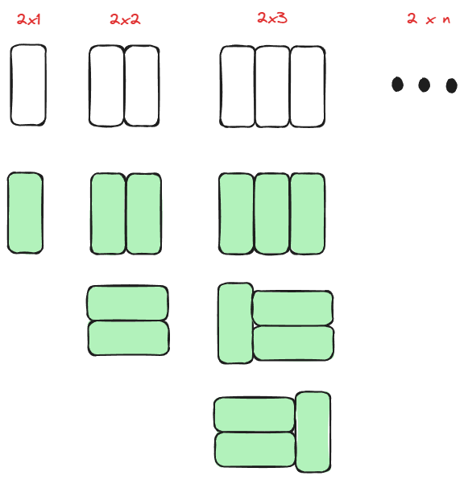

## 문제

### 링크

[프로그래머스/2 x n 타일링](https://school.programmers.co.kr/learn/courses/30/lessons/12900)

<br>

### 문제 설명

가로 길이가 2이고 세로의 길이가 1인 직사각형모양의 타일이 있습니다. 이 직사각형 타일을 이용하여 세로의 길이가 2이고 가로의 길이가 n인 바닥을 가득 채우려고 합니다. 타일을 채울 때는 다음과 같이 2가지 방법이 있습니다.

- 타일을 가로로 배치 하는 경우
- 타일을 세로로 배치 하는 경우

예를들어서 n이 7인 직사각형은 다음과 같이 채울 수 있습니다.


직사각형의 가로의 길이 n이 매개변수로 주어질 때, 이 직사각형을 채우는 방법의 수를 return 하는 solution 함수를 완성해주세요.

<br>

### 입력 & 출력

#### 제한사항

- 가로의 길이 n은 60,000이하의 자연수 입니다.
- 경우의 수가 많아 질 수 있으므로, 경우의 수를 1,000,000,007으로 나눈 나머지를 return해주세요.

#### 입출력 예

|n|result|
|---|---|
|4|5|

<br>

## 풀이

타일링 문제의 경우 <b>직사각형을 채울 수 있는 가장 작은 단위</b>를 찾아야 한다.  

이는 직사각형의 가로 길이 1부터 증가시켜 가며 찾으면 되는데, 아래의 그림과 같다.  



그림을 보면 `2 x 1`, `2 x 2` 크기의 직사각형은 고유한 타일 조합을 갖는다. 하지만 
`2 x 3`의 경우 앞선 `2 x 1`과 `2 x 2`의 모양이 반복된다.  

이를 통해서 이 문제의 <b>가장 작은 단위</b>는 `2 x 1`과 `2 x 2`임을 알 수 있다.  

이제 `2 x n`의 크기를 갖는 직사각형인 경우에 `n`을 `1`과 `2`로 구분할 수 있는 모든 경우를 찾으면 된다.  

예를 들어, `2 x 3`인 경우 `3`은 `1+1+1`, `1+2`, `2+1`로 구분된다.  

코드로는 다음과 같이 구현할 수 있다.  

```java
int recursive(int n) {
    if (n == 1)
        return 1;
    if (n == 2)
        return 2;
    
    return recursive(n - 1) + recursive(n - 2);
}
```

하지만 이 코드는 시간 복잡도를 고려할 때 적절하지 않다. 만약 `n = 10`인 경우를 생각해보겠다.  


`recursive` 메서드에 의해서 위의 그림과 같이 동작할 것이다. 하지만 이때 같은 숫자들이 몇 번씩 반복되는 것을 확인할 수 있다.  

이는 불필요한 동작이며, `n`이 커질 수록 성능에 악영향을 끼치게 된다.  

그래서 <b>다이나믹 프로그래밍</b> 기법을 활용하여 중복을 없앤다.  

<br>

<b>다이나믹 프로그래밍 기법 활용</b>  

`n`은 결국 `n - 1`과 `n - 2`의 합으로 만들 수 있다. 이것을 직사각형의 가로 길이가 1일 때부터 증가시키며 쌓아가면 목표로 하는 
`n`을 찾을 수 있다.  


<br>

### 시간 복잡도

입력(`n`)에 대해서 가로의 길이 1부터 n까지 반복하면 된다. <b>O(n)</b>  

<br>

### 구현 코드

```java
package level2.타일링2xn;

public class solve_1st {
    class Solution {
        public int solution(int n) {
            int answer = 0;

            int[] dp = new int[n + 1];
            dp[1] = 1;
            dp[2] = 2;
            for (int i = 3; i <= n; i++) {
                dp[i] = (dp[i - 1] + dp[i - 2])%1_000_000_007;
            }
            answer = dp[n];

            return answer;
        }
    }
}
```