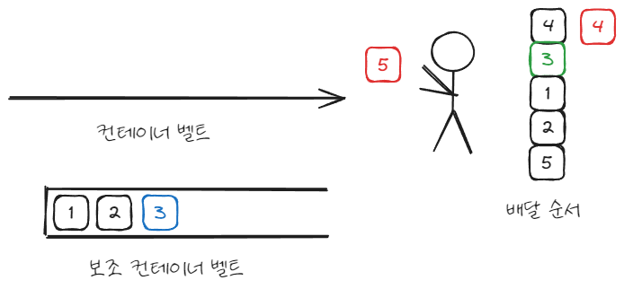
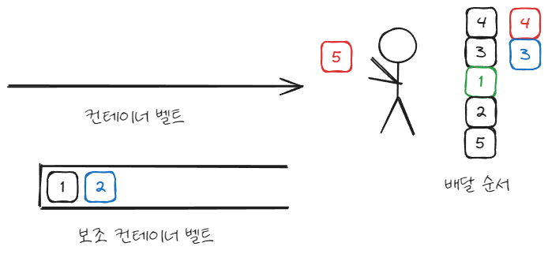

## 문제

### 링크

[프로그래머스/택배상자](https://school.programmers.co.kr/learn/courses/30/lessons/131704)

<br>

### 문제 설명

영재는 택배상자를 트럭에 싣는 일을 합니다. 영재가 실어야 하는 택배상자는 크기가 모두 같으며 1번 상자부터 n번 상자까지 번호가 증가하는 순서대로 컨테이너 벨트에 일렬로 놓여 영재에게 전달됩니다. 컨테이너 벨트는 한 방향으로만 진행이 가능해서 벨트에 놓인 순서대로(1번 상자부터) 상자를 내릴 수 있습니다. 하지만 컨테이너 벨트에 놓인 순서대로 택배상자를 내려 바로 트럭에 싣게 되면 택배 기사님이 배달하는 순서와 택배상자가 실려 있는 순서가 맞지 않아 배달에 차질이 생깁니다. 따라서 택배 기사님이 미리 알려준 순서에 맞게 영재가 택배상자를 실어야 합니다.

만약 컨테이너 벨트의 맨 앞에 놓인 상자가 현재 트럭에 실어야 하는 순서가 아니라면 그 상자를 트럭에 실을 순서가 될 때까지 잠시 다른 곳에 보관해야 합니다. 하지만 고객의 물건을 함부로 땅에 둘 수 없어 보조 컨테이너 벨트를 추가로 설치하였습니다. 보조 컨테이너 벨트는 앞 뒤로 이동이 가능하지만 입구 외에 다른 면이 막혀 있어서 맨 앞의 상자만 뺄 수 있습니다(즉, 가장 마지막에 보조 컨테이너 벨트에 보관한 상자부터 꺼내게 됩니다). 보조 컨테이너 벨트를 이용해도 기사님이 원하는 순서대로 상자를 싣지 못 한다면, 더 이상 상자를 싣지 않습니다.

예를 들어, 영재가 5개의 상자를 실어야 하며, 택배 기사님이 알려준 순서가 기존의 컨테이너 벨트에 네 번째, 세 번째, 첫 번째, 두 번째, 다섯 번째 놓인 택배상자 순서인 경우, 영재는 우선 첫 번째, 두 번째, 세 번째 상자를 보조 컨테이너 벨트에 보관합니다. 그 후 네 번째 상자를 트럭에 싣고 보조 컨테이너 벨트에서 세 번째 상자 빼서 트럭에싣습니다. 다음으로 첫 번째 상자를 실어야 하지만 보조 컨테이너 벨트에서는 두 번째 상자를, 기존의 컨테이너 벨트에는 다섯 번째 상자를 꺼낼 수 있기 때문에 더이상의 상자는 실을 수 없습니다. 따라서 트럭에는 2개의 상자만 실리게 됩니다.

택배 기사님이 원하는 상자 순서를 나타내는 정수 배열 `order`가 주어졌을 때, 영재가 몇 개의 상자를 실을 수 있는지 return 하는 solution 함수를 완성하세요.

<br>

### 입력 & 출력

#### 제한사항

- 1 ≤ `order`의 길이 ≤ 1,000,000
- `order`는 1이상 `order`의 길이 이하의 모든 정수가 한번씩 등장합니다.
- `order[i]`는 기존의 컨테이너 벨트에 `order[i]`번째 상자를 i+1번째로 트럭에 실어야 함을 의미합니다.

#### 입출력 예

|order|result|
|---|---|
|[4, 3, 1, 2, 5]|2|
|[5, 4, 3, 2, 1]|5|

<br>

## 풀이

보조 컨테이너 벨트는 Stack 자료 구조와 동일하게 동작한다.  


먼저 컨테이너 벨트의 물건과 택배 기사님이 원하는 상자 순서의 값을 서로 비교한다.  

위의 그림에서는 컨테이너 벨트(`1`), 배달 순서(`4`)를 먼저 비교하게 된다. 이때 값이 서로 다르기 때문에 컨테이너 벨트(`1`)을 
보조 컨테이너 벨트에 놓아서 다음 컨테이너 벨트(`2`)가 오도록 만든다.  


이때 컨테이너 벨트(`2`)와 배달 순서(`4`)를 비교하고, 보조 컨테이너 벨트(`1`)와 배달 순서(`4`)가 다름을 알 수 있다. 
다시 `2`를 보조 컨테이너 벨트에 놓는다.  

이 과정을 반복하면 컨테이너 벨트(`4`)와 배달 순서(`4`)가 된다.  


컨테이너 벨트(`4`)와 배달 순서(`4`)가 같기 때문에 해당 물품을 실는다. 
이후 보조 컨테이너 벨트(`3`)와 배달 순서(`3`)가 같기 때문에 해당 물품을 실는다.  



마지막으로 컨테이너 벨트의 마지막 물품(`5`)과 보조 컨테이너 벨트(`2`)가 배달 순서(`1`)를 모두 만족하지 않으므로 
더 이상 실을 수 있는 물품은 없다.  



<br>

### 시간 복잡도

입력(`order`)의 길이가 n일 때 &rarr; O(n)  

또한 Stack에 대한 작업도 있지만 Stack의 값을 모두 탐색하지 않기 때문에 고려하지 않아도 될 듯 하다.  

결과적으로 <b>O(n)</b>이다.  

<br>

### 구현 코드

```java
package level2.택배상자;

import java.util.Stack;

public class solve_1st {
    class Solution {
        public int solution(int[] order) {
            int answer = 0;

            int len = order.length;
            Stack<Integer> stack = new Stack<>();
            int idx = 0;
            for (int i = 1; i <= len; i++) {
                if (i == order[idx]) {
                    answer++;
                    idx++;
                } else {
                    stack.push(i);
                }

                while (!stack.isEmpty() && stack.peek() == order[idx]) {
                    answer++;
                    stack.pop();
                    idx++;
                }
            }

            return answer;
        }
    }
}
```