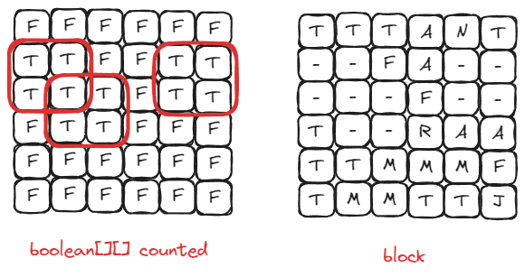
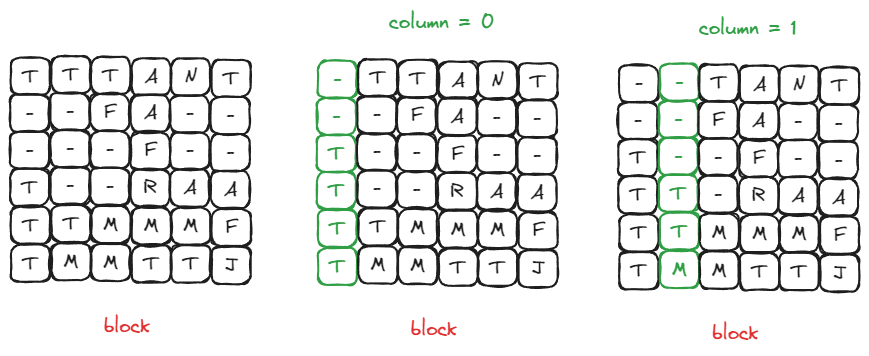

## 문제

### 링크

[프로그래머스/[3차] 프렌즈4블록](https://school.programmers.co.kr/learn/courses/30/lessons/17679)

<br>

### 문제 설명

블라인드 공채를 통과한 신입 사원 라이언은 신규 게임 개발 업무를 맡게 되었다. 이번에 출시할 게임 제목은 "프렌즈4블록".  
같은 모양의 카카오프렌즈 블록이 2×2 형태로 4개가 붙어있을 경우 사라지면서 점수를 얻는 게임이다.

  
만약 판이 위와 같이 주어질 경우, 라이언이 2×2로 배치된 7개 블록과 콘이 2×2로 배치된 4개 블록이 지워진다. 같은 블록은 여러 2×2에 포함될 수 있으며, 지워지는 조건에 만족하는 2×2 모양이 여러 개 있다면 한꺼번에 지워진다.


블록이 지워진 후에 위에 있는 블록이 아래로 떨어져 빈 공간을 채우게 된다.


만약 빈 공간을 채운 후에 다시 2×2 형태로 같은 모양의 블록이 모이면 다시 지워지고 떨어지고를 반복하게 된다.  


위 초기 배치를 문자로 표시하면 아래와 같다.

```
TTTANT
RRFACC
RRRFCC
TRRRAA
TTMMMF
TMMTTJ
```

각 문자는 라이언(R), 무지(M), 어피치(A), 프로도(F), 네오(N), 튜브(T), 제이지(J), 콘(C)을 의미한다

입력으로 블록의 첫 배치가 주어졌을 때, 지워지는 블록은 모두 몇 개인지 판단하는 프로그램을 제작하라.

<br>

### 입력 & 출력

#### 입력 형식

- 입력으로 판의 높이 `m`, 폭 `n`과 판의 배치 정보 `board`가 들어온다.
- 2 ≦ `n`, `m` ≦ 30
- `board`는 길이 `n`인 문자열 `m`개의 배열로 주어진다. 블록을 나타내는 문자는 대문자 A에서 Z가 사용된다.

#### 출력 형식

입력으로 주어진 판 정보를 가지고 몇 개의 블록이 지워질지 출력하라.

#### 입출력 예제

|m|n|board|answer|
|---|---|---|---|
|4|5|["CCBDE", "AAADE", "AAABF", "CCBBF"]|14|
|6|6|["TTTANT", "RRFACC", "RRRFCC", "TRRRAA", "TTMMMF", "TMMTTJ"]|15|

#### 예제에 대한 설명

- 입출력 예제 1의 경우, 첫 번째에는 A 블록 6개가 지워지고, 두 번째에는 B 블록 4개와 C 블록 4개가 지워져, 모두 14개의 블록이 지워진다.
- 입출력 예제 2는 본문 설명에 있는 그림을 옮긴 것이다. 11개와 4개의 블록이 차례로 지워지며, 모두 15개의 블록이 지워진다.

<br>

## 풀이

1. 입력(`block`)에서 조건을 만족하는 2x2 블록을 찾는다.
2. 2x2 블록을 체크한 배열(`counted`)으로 삭제할 블록의 숫자를 세고, 삭제한다.
3. 비어 있는 블록을 채운다.
4. 1 ~ 3번 반복


<b>1. 입력(`block`)에서 조건을 만족하는 2x2 블록을 찾는다.</b>  

블록의 번호가 `1 ~ m`, `1 ~ n`일 때, 탐색을 반복할 범위는 `1 ~ m - 1`, `1 ~ n - 1`이다.  

주의할 점은 한 번 탐색한 2x2 블록도 다시 확인하면서, 블록을 셀 때는 중복되서는 안된다.  

그래서 `block`과 같은 크기의 배열(`counted`)을 만들어 2x2 블록임을 체크하도록 한다.  


<br>

<b>2. 2x2 블록을 체크한 배열(`counted`)으로 삭제할 블록의 숫자를 세고, 삭제한다.</b>  

삭제할 블록을 별도로 표시하기 위해서 `'-'`를 사용한다.  



<br>

<b>3. 비어 있는 블록을 채운다.</b>  

`block`의 열을 반복하면서 맨 아래의 행부터 검사를 시작한다.  

만약 `'-'`이라면 좌표를 Queue에 저장해 두었다가, 
행을 검사하면서 `'-'`을 제외한 문제를 만나면 Queue에 저장한 좌표에 해당 문자를 대입한다.  

이때 대입한 문자의 좌표는 비었기 때문에 다시 `'-'`를 대입한다.  



모두 진행하면 다시 1번부터 반복한다.  

<br>

### 시간 복잡도

풀이의 1 ~ 3을 반복하면서 입력(`block`) 의 크기를 모두 탐색한다.  

다만 중첩하지 않기 때문에 결과적으로 <b>O(mn)</b>이다.  

<br>

### 구현 코드
```java
package level2.프렌즈4블록;

import java.util.LinkedList;
import java.util.Queue;

public class solve_1st {
    class Solution {

        boolean[][] counted;
        char[][] map;
        int M;
        int N;

        public int solution(int m, int n, String[] board) {
            int answer = 0;

            M = m;
            N = n;
            counted = new boolean[M][N];
            map = new char[M][N];
            for (int i = 0; i < M; i++)
                map[i] = board[i].toCharArray();

            while (check()) {
                //check();
                // for (boolean[] c : counted)
                //     System.out.println(Arrays.toString(c));
                answer += countAndRemove();
                // for (char[] c : map)
                //     System.out.println(Arrays.toString(c));
                // System.out.println("*****");
                drop();
                // for (char[] c : map)
                //     System.out.println(Arrays.toString(c));
                counted = new boolean[M][N];
            }

            return answer;
        }

        boolean check() {
            boolean flag = false;
            for (int m = 0; m < M - 1; m++) {
                for (int n = 0; n < N - 1; n++) {
                    if (map[m][n] == '-') continue;
                    if (map[m][n] != map[m][n + 1]) continue;
                    if (map[m][n] != map[m + 1][n]) continue;
                    if (map[m][n] != map[m + 1][n + 1]) continue;
                    counted[m][n] = counted[m][n + 1] = counted[m + 1][n] = counted[m + 1][n + 1] = true;
                    flag = true;
                }
            }

            if (flag)
                return true;
            return false;
        }

        int countAndRemove() {
            int cnt = 0;
            for (int m = 0; m < M; m++) {
                for (int n = 0; n < N; n++) {
                    if (counted[m][n]) {
                        cnt++;
                        map[m][n] = '-';
                    }
                }
            }

            return cnt;
        }

        void drop() {
            for (int n = 0; n < N; n++) {
                Queue<Integer> q = new LinkedList<>();
                for (int m = M - 1; m >= 0; m--) {
                    if (map[m][n] == '-')
                        q.add(m);
                    else if (!q.isEmpty()) {
                        map[q.poll()][n] = map[m][n];
                        map[m][n] = '-';
                        q.add(m);
                    }
                }
            }
        }
    }
}
```