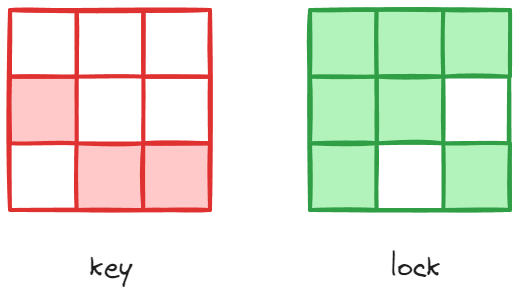
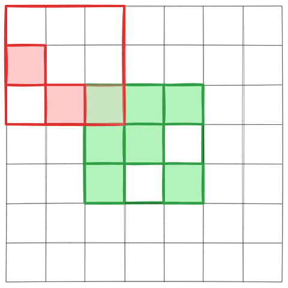
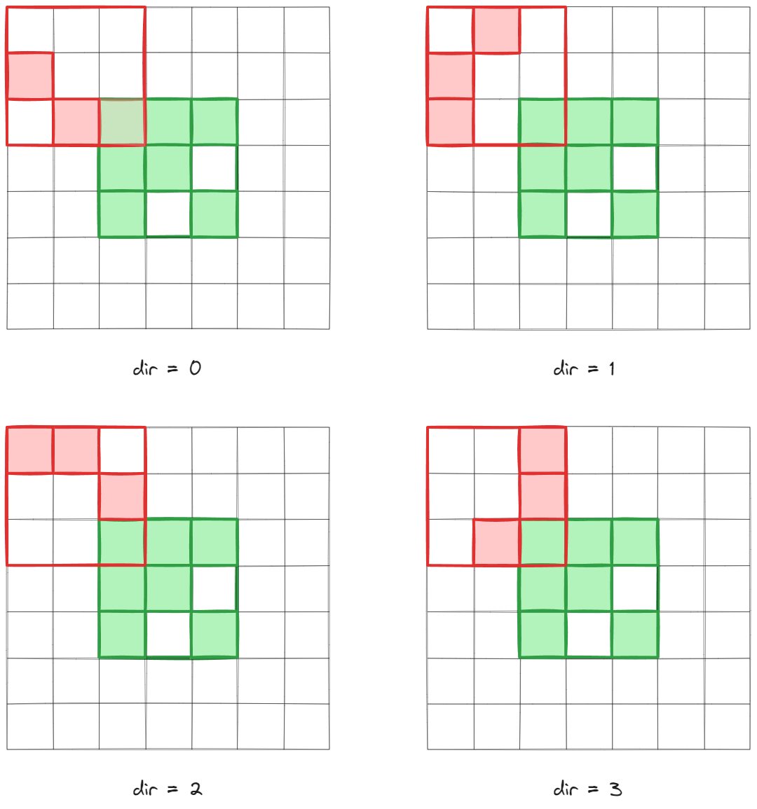
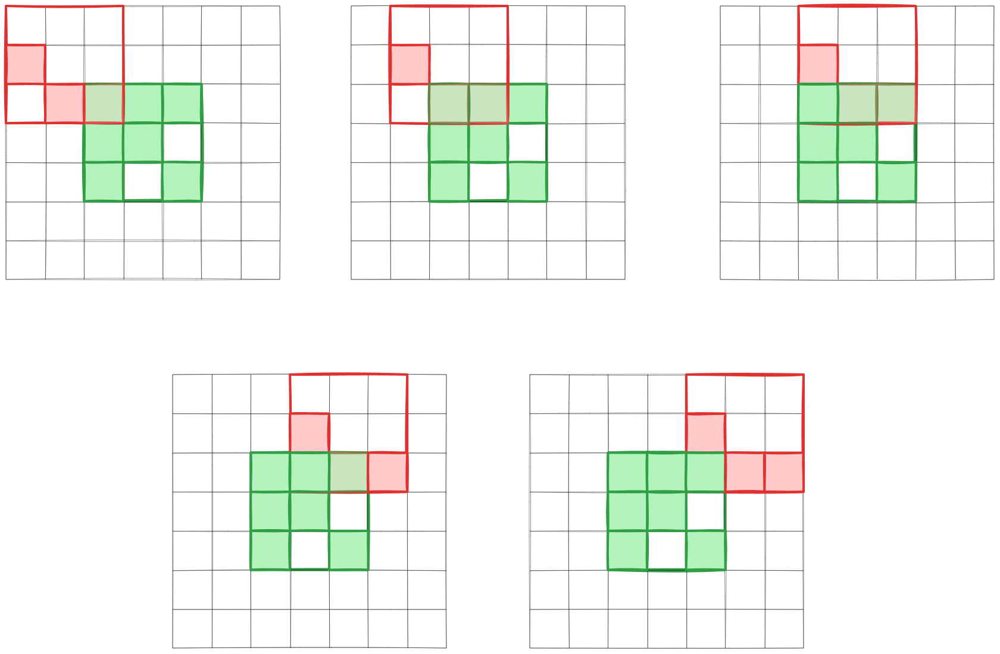

### 문제 링크

[프로그래머스/자물쇠와 열쇠](https://school.programmers.co.kr/learn/courses/30/lessons/60059)

<br>

### 문제

고고학자인 **"튜브"**는 고대 유적지에서 보물과 유적이 가득할 것으로 추정되는 비밀의 문을 발견하였습니다. 그런데 문을 열려고 살펴보니 특이한 형태의 **자물쇠**로 잠겨 있었고 문 앞에는 특이한 형태의 **열쇠**와 함께 자물쇠를 푸는 방법에 대해 다음과 같이 설명해 주는 종이가 발견되었습니다.

잠겨있는 자물쇠는 격자 한 칸의 크기가 **`1 x 1`**인 **`N x N`** 크기의 정사각 격자 형태이고 특이한 모양의 열쇠는 **`M x M`** 크기인 정사각 격자 형태로 되어 있습니다.

자물쇠에는 홈이 파여 있고 열쇠 또한 홈과 돌기 부분이 있습니다. 열쇠는 회전과 이동이 가능하며 열쇠의 돌기 부분을 자물쇠의 홈 부분에 딱 맞게 채우면 자물쇠가 열리게 되는 구조입니다. 자물쇠 영역을 벗어난 부분에 있는 열쇠의 홈과 돌기는 자물쇠를 여는 데 영향을 주지 않지만, 자물쇠 영역 내에서는 열쇠의 돌기 부분과 자물쇠의 홈 부분이 정확히 일치해야 하며 열쇠의 돌기와 자물쇠의 돌기가 만나서는 안됩니다. 또한 자물쇠의 모든 홈을 채워 비어있는 곳이 없어야 자물쇠를 열 수 있습니다.

열쇠를 나타내는 2차원 배열 key와 자물쇠를 나타내는 2차원 배열 lock이 매개변수로 주어질 때, 열쇠로 자물쇠를 열수 있으면 true를, 열 수 없으면 false를 return 하도록 solution 함수를 완성해주세요.

<br>

### 입력 & 출력

#### 제한사항

- key는 M x M(3 ≤ M ≤ 20, M은 자연수)크기 2차원 배열입니다.
- lock은 N x N(3 ≤ N ≤ 20, N은 자연수)크기 2차원 배열입니다.
- M은 항상 N 이하입니다.
- key와 lock의 원소는 0 또는 1로 이루어져 있습니다.
    - 0은 홈 부분, 1은 돌기 부분을 나타냅니다.

<br>

#### 입출력 예

|key|lock|result|
|---|---|---|
|[[0, 0, 0], [1, 0, 0], [0, 1, 1]]|[[1, 1, 1], [1, 1, 0], [1, 0, 1]]|true|

<br>

## 풀이



key와 lock은 위와 같은 모양을 가진다.  

이때 lock을 확장하여 key와의 경우의 수를 그려볼 수 있는데, 다음과 같다.   



이제 key를 90도 방향으로 돌리고, 한 칸씩 이동 시켜서 lock을 열 수 있는 지 확인하면 된다.  

먼저 회전은 아래와 같이 이뤄진다. key의 원소를 회전에 맞게 이동해야 함을 유의한다.  



또한 한 칸씩 움직이는 경우는 아래와 같다.



이로써 lock을 확장해야 하는 크기도 알 수 있고, key를 lock에 맞춰보는 경우의 수를 모두 구해볼 수 있다.  

<br>

이후에는 각 경우의 수마다 key가 lock을 열 수 있는지 확인하면 된다.  

색상이 들어 있는 좌표를 `1`로 비어 있는 곳을 `0`으로 가정하고, 

좌표의 숫자들을 더한다. 이제 lock 범위의 좌표에서 숫자들을 확인하고, `1`없는 곳이 

한 군데라도 있다면 `false`를 반환, 모두 `1`이라면 `true`를 반환한다.  

<br>

### 구현 코드
```java
package level3.자물쇠와열쇠;

public class 자물쇠와열쇠 {

    private static int[][] newLock;

    public boolean solution(int[][] key, int[][] lock) {

        int N = lock.length + (key.length - 1)*2;
        int offset = lock.length + key.length - 1;

        for (int i = 0; i < offset; i++) {
            for (int j = 0; j < offset; j++) {
                for (int dir = 0; dir < 4; dir++) {
                    newLock = new int[N][N];
                    initLock(key.length - 1, lock);
                    rotateKey(i, j, key, dir);

                    boolean check = checkPlace(key.length - 1, lock);
                    if (check) {
                        return true;
                    }
                }
            }
        }

        return false;
    }

    private void initLock(int offset, int[][] lock) {
        for (int i = 0; i < lock.length; i++) {
            for (int j = 0; j < lock.length; j++) {
                newLock[i + offset][j + offset] = lock[i][j];
            }
        }
    }

    private static void rotateKey(int x, int y, int[][] key, int dir) {
        for (int i = 0; i < key.length; i++) {
            for (int j = 0; j < key[i].length; j++) {
                if (dir == 0) {
                    newLock[x + i][y + j] += key[i][j];
                } else if (dir == 1) {
                    newLock[x + i][y + j] += key[key.length - j - 1][i];
                } else if (dir == 2) {
                    newLock[x + i][y + j] += key[key.length - i - 1][key.length - j - 1];
                } else if (dir == 3) {
                    newLock[x + i][y + j] += key[j][key.length - i - 1];
                }
            }
        }
    }

    private static boolean checkPlace(int index, int[][] lock) {
        for (int i = 0; i < lock.length; i++) {
            for (int j = 0; j < lock[i].length; j++) {
                if (newLock[index + i][index + j] != 1) {
                    return false;
                }
            }
        }
        return true;
    }
}
```